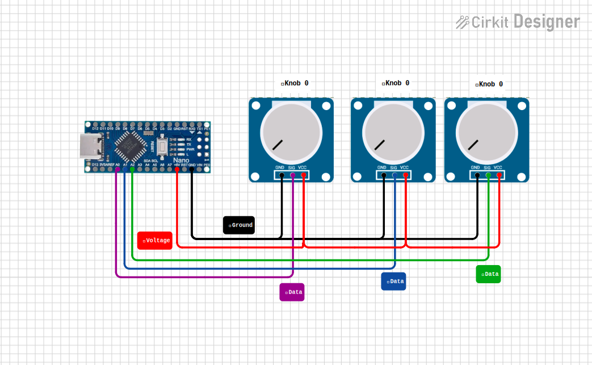

# Arduino Nano Setup

This guide focuses on the controller board used by the current Ioruba stack.

## Circuit Design

<p align="center">
  
</p>

## Target hardware

- `Arduino Nano ATmega328P`
- `3x B10K / 10k linear potentiometers`
- `A0`, `A1`, and `A2` as analog inputs
- `9600` baud serial output

If you still need the physical wiring reference, read [docs/guides/hardware-setup.md](docs/guides/hardware-setup.md) first.

## Wiring summary

| Knob | Left pin | Center pin | Right pin |
| ---- | -------- | ---------- | --------- |
| 1    | `GND`    | `A0`       | `5V`      |
| 2    | `GND`    | `A1`       | `5V`      |
| 3    | `GND`    | `A2`       | `5V`      |

> If a knob feels inverted, swap the two outer pins.

## Recommended firmware

Use the active sketch:

- [firmware/arduino/ioruba-controller/ioruba-controller.ino](firmware/arduino/ioruba-controller/ioruba-controller.ino)

What it sends:

- a startup and on-demand handshake such as `HELLO board=Ioruba Nano; fw=0.4.0; protocol=2; knobs=3; threshold=4; deadzone=7; smooth=75; mins=0,0,0; maxs=1023,1023,1023`
- smoothed analog readings
- frames roughly every `40 ms` when values move
- pipe-separated lines such as `512|768|1023`

The desktop runtime still accepts the legacy `P1:512` packet format for compatibility, but the current firmware now also reports controller tuning and calibration data in the handshake.

## Detect the board

Use `arduino-cli` first:

```bash
arduino-cli board list
```

You can also inspect the Linux device files directly:

```bash
ls -l /dev/ttyUSB* /dev/ttyACM* 2>/dev/null
```

Typical Nano clone USB chip labels include `CH340` and `FT232R USB UART`.

## Linux permissions

Depending on the distro, add your user to `dialout` or `uucp`:

```bash
sudo usermod -a -G dialout $USER
sudo usermod -a -G uucp $USER
```

Then log out and back in before testing the serial connection again.

## Compile the firmware

```bash
arduino-cli compile --fqbn arduino:avr:nano firmware/arduino/ioruba-controller
```

## Upload to the Nano

Standard Nano profile:

```bash
arduino-cli upload -p /dev/ttyUSB0 --fqbn arduino:avr:nano firmware/arduino/ioruba-controller
```

Old bootloader profile for common clones:

```bash
arduino-cli upload -p /dev/ttyUSB0 --fqbn arduino:avr:nano:cpu=atmega328old firmware/arduino/ioruba-controller
```

## Validate serial output

After flashing, the board should emit lines like:

```text
HELLO board=Ioruba Nano; fw=0.4.0; protocol=2; knobs=3; threshold=4; deadzone=7; smooth=75; mins=0,0,0; maxs=1023,1023,1023
512|768|1023
```

The desktop app also requests the same handshake with `HELLO?` whenever it connects or reconnects.

Practical smoke test:

1. launch the desktop shell with `npm run desktop:watch`
2. choose the detected serial port if needed
3. open the `Watch` tab
4. turn the knobs and confirm the telemetry updates
5. on Linux, verify the mapped audio targets respond

## If upload fails

Common symptoms:

- `not in sync`
- `unable to read signature data`
- the board appears as `Unknown` in `arduino-cli board list`

Practical fixes:

- try both Nano processor profiles
- press `RESET` right before the upload starts
- make sure no other app is holding `/dev/ttyUSB0`
- swap the USB cable for a known data cable
- confirm the board is really a Nano-compatible `ATmega328P`
- if necessary, reburn the bootloader with an ISP programmer

## Useful debug checks

Check whether something is already holding the port:

```bash
fuser -v /dev/ttyUSB0
```

List active Linux audio applications:

```bash
pactl list short sink-inputs
```

## Related guides

- [QUICKSTART.md](QUICKSTART.md)
- [TESTING.md](TESTING.md)
- [docs/guides/hardware-setup.md](docs/guides/hardware-setup.md)
