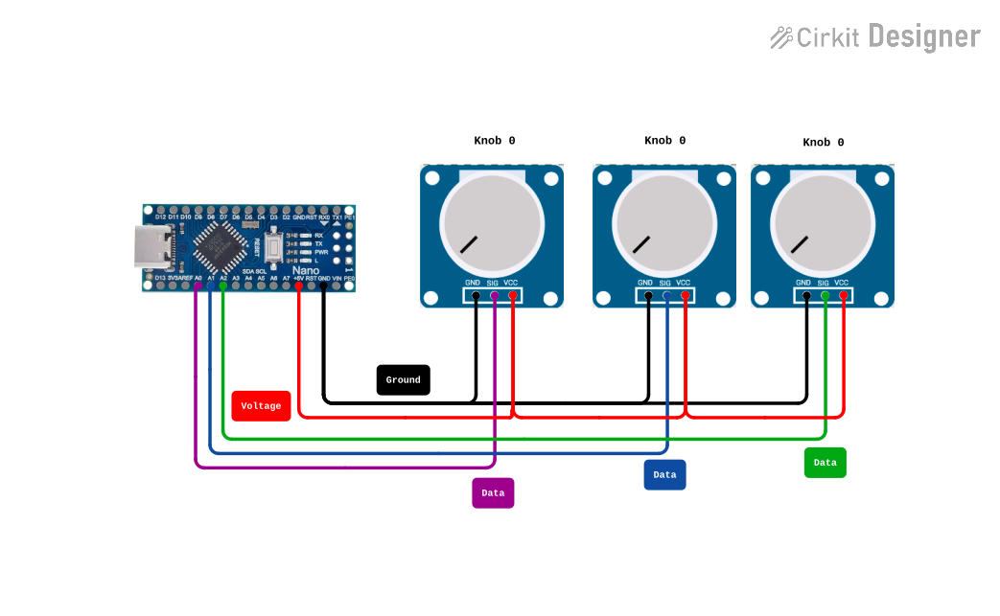

# Arduino Nano Setup

This guide covers the reference Ioruba controller: an Arduino Nano ATmega328P with three potentiometers. For other supported boards, more knobs, buttons, or encoders, use the broader [hardware setup guide](docs/guides/hardware-setup.md).

## Reference circuit

<p align="center">
  
</p>

### Parts

- Arduino Nano ATmega328P;
- three B10K / 10k linear potentiometers;
- USB data cable;
- jumper wires and a breadboard or enclosure.

### Wiring

| Knob | Outer pin | Center/wiper | Other outer pin |
| --- | --- | --- | --- |
| 1 | `GND` | `A0` | `5V` |
| 2 | `GND` | `A1` | `5V` |
| 3 | `GND` | `A2` | `5V` |

Use a shared ground and 5 V rail. If clockwise motion lowers the value when you want it to raise the value, swap the two outer pins on that potentiometer.

## Install Arduino CLI and the AVR core

Follow the [Arduino CLI installation instructions](https://arduino.github.io/arduino-cli/latest/installation/), then install the AVR core:

```bash
arduino-cli config init
arduino-cli core update-index
arduino-cli core install arduino:avr
```

Detect the board and serial port:

```bash
arduino-cli board list
```

Typical Linux ports are `/dev/ttyUSB0` for CH340/FTDI-based clones and `/dev/ttyACM0` for native USB serial devices.

## Linux serial permissions

If access is denied, add your user to the serial group used by your distribution:

```bash
sudo usermod -a -G dialout "$USER"
sudo usermod -a -G uucp "$USER"
```

Not every distribution uses both groups. Log out and back in after changing membership.

## Compile the firmware

The active sketch is [`firmware/arduino/ioruba-controller/ioruba-controller.ino`](firmware/arduino/ioruba-controller/ioruba-controller.ino).

Compile from the repository root:

```bash
npm run firmware:compile
```

Equivalent direct command:

```bash
arduino-cli compile \
  --fqbn arduino:avr:nano \
  firmware/arduino/ioruba-controller
```

## Upload

Standard Nano:

```bash
arduino-cli upload \
  -p /dev/ttyUSB0 \
  --fqbn arduino:avr:nano \
  firmware/arduino/ioruba-controller
```

Common Nano clone with the old bootloader:

```bash
arduino-cli upload \
  -p /dev/ttyUSB0 \
  --fqbn arduino:avr:nano:cpu=atmega328old \
  firmware/arduino/ioruba-controller
```

Replace the port with the one reported by `arduino-cli board list`.

## Current serial contract

The default firmware configuration is:

- baud rate: **115200**;
- firmware version: **0.6.1**;
- protocol version: **2**;
- three 10-bit analog controls (`0..1023`);
- frames sent on meaningful movement, with heartbeat support;
- calibration/tuning persisted in EEPROM.

After startup, or when the desktop sends `HELLO?`, the board emits a handshake followed by knob frames:

```text
HELLO board=Ioruba Nano; fw=0.6.1; protocol=2; knobs=3; mcu=ATmega328P; adcBits=10; threshold=4; deadzone=7; smooth=75; mins=0,0,0; maxs=1023,1023,1023
512|768|1023
```

`fw=` and the desktop app version are independent. Compatibility is determined by `protocol=`; the current desktop expects protocol 2. The parser also accepts legacy `P1:512` packets.

## Validate the controller

### In the desktop app

1. Start Ioruba or run `npm run desktop:watch`.
2. Select the detected serial port if needed.
3. Confirm connection health becomes connected.
4. Open **Watch** and verify the handshake and knob frames.
5. Open Hardware and confirm board, MCU, ADC bits, protocol, and calibration.
6. Turn each knob through its range and verify telemetry.
7. Run the calibration wizard if the controls do not reach 0% or 100%.

### In a serial monitor

Use any monitor configured for **115200 baud**. Close the monitor before connecting Ioruba because only one process can normally own the port.

With Arduino CLI:

```bash
arduino-cli monitor -p /dev/ttyUSB0 -c baudrate=115200
```

## Calibration and firmware commands

The desktop synchronizes profile calibration and tuning with the firmware through the `CONFIG` command. The board stores compatible values in EEPROM.

Useful protocol commands include:

- `HELLO?` — request the handshake;
- `EVENTS ON` / `EVENTS OFF` — enable or disable optional button/encoder frames;
- `RAW ON` / `RAW OFF` — switch raw ADC capture for calibration workflows;
- `CONFIG ...` — update threshold, deadzone, smoothing, and calibration values.

Normal users should use the app's Hardware calibration wizard instead of sending these commands manually.

## Upload troubleshooting

### `not in sync` or signature errors

- Try both Nano processor profiles shown above.
- Press `RESET` immediately before upload starts.
- Confirm the board is an ATmega328P-compatible Nano.
- Use a known USB data cable.
- Close Ioruba, Arduino Serial Monitor, and any other serial tool.
- Reburn the bootloader with an ISP programmer if both profiles fail.

### Port is busy

On Linux:

```bash
fuser -v /dev/ttyUSB0
```

Close the process holding the port before uploading or launching Ioruba.

### Noisy or unstable values

- Keep analog wiring short and share a solid ground.
- Confirm the center pin is connected to the analog input.
- Run the calibration wizard.
- Increase the profile/firmware smoothing only after checking wiring.
- ESP32/ESP8266 builds disable Wi-Fi because radio activity can add ADC noise; this does not apply to the Nano.

## Related documentation

- [Quick start](QUICKSTART.md)
- [Hardware setup and supported boards](docs/guides/hardware-setup.md)
- [Testing](TESTING.md)
- [Support playbook](docs/debug/support.md)
