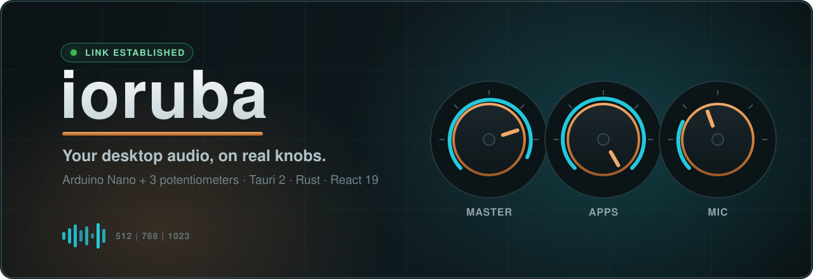

<div align="center">



<br />
<br />

**A tactile desktop audio deck. Turn an Arduino Nano + 3 knobs into a real mixer for your computer.**

[](https://github.com/bernardopg/ioruba/actions/workflows/release.yml)
[](https://github.com/bernardopg/ioruba/actions/workflows/ci.yml)
[](package.json)
[](TODO.md)
[](https://github.com/bernardopg/ioruba/commits/main)
[](LICENSE)

[](https://github.com/sponsors/bernardopg)
[](https://www.buymeacoffee.com/WctwoM9eMU)

[](https://tauri.app/)
[](https://www.rust-lang.org/)
[](https://www.typescriptlang.org/)
[](https://isocpp.org/)
[](https://www.arduino.cc/)
[](https://nodejs.org/en)
[](docs/translations/pt-br/README.md)

[](#-platform-support)
[](#-platform-support)
[](#-platform-support)
[](#-platform-support)

<br />

[**Download**](https://github.com/bernardopg/ioruba/releases/latest) · [**Quick Start**](QUICKSTART.md) · [**Build Your Controller**](docs/guides/hardware-setup.md) · [**Roadmap**](TODO.md)

</div>

---

## Why Ioruba?

Software volume sliders are fine until you have music, a call, and a stream running at once and need to ride three levels _now_. Ioruba gives those levels back their knobs.

Spin a physical dial, watch the bar move, hear the change — no alt-tabbing, no hunting through audio settings. It's the hands-on feel of a small hardware mixer, rebuilt on a modern stack:

- 🎛️ **Tactile by design** — three real potentiometers map to three audio targets. Master, your apps, your mic — each on its own knob.
- 🐧 **Real audio control on Linux** — drive master volume, individual applications, microphone sources, and output sinks through `pactl`.
- 📡 **Live telemetry you can trust** — a connection state you can never misread, per-knob min/avg/max statistics, and a persistent watch log.
- 🧩 **Yours to remix** — editable JSON profiles, ready-made presets, and import/export for backup and sharing.
- 💸 **Cheap to build** — an Arduino Nano, three pots, and a handful of wires. The firmware and wiring guide are in this repo.
- 🛠️ **Built like a tool, not a toy** — Tauri 2 + React 19 + TypeScript front end, a Rust audio backend, Arduino C++ firmware, and CI gating every layer.

> **Platform status at a glance**
> Real, full audio control is **production-ready on Linux** via `pactl`.
> **Windows** and **macOS** control `master` / default-output volume through Core Audio; application, source, and sink targets remain Linux-only.

<div align="center">


<sub>Tactile dashboard — copper + teal instrument-panel direction, connection state always front and center.</sub>

</div>

---

## Table of contents

- [Why Ioruba?](#why-ioruba)
- [Table of contents](#table-of-contents)
- [✨ Feature highlights](#-feature-highlights)
- [🖥️ Platform support](#️-platform-support)
- [🔌 How it works](#-how-it-works)
- [⚡ Install in one line](#-install-in-one-line)
  - [Arch Linux (AUR)](#arch-linux-aur)
  - [Debian / Ubuntu / Linux Mint / Pop!\_OS](#debian--ubuntu--linux-mint--pop_os)
  - [Fedora / RHEL / CentOS Stream / openSUSE (RPM)](#fedora--rhel--centos-stream--opensuse-rpm)
  - [Any Linux distro (AppImage)](#any-linux-distro-appimage)
  - [Windows](#windows)
  - [macOS (Apple Silicon and Intel)](#macos-apple-silicon-and-intel)
- [🛠️ Build from source](#️-build-from-source)
- [✅ First launch checklist](#-first-launch-checklist)
- [🎚️ Default knob mapping](#️-default-knob-mapping)
- [📂 Where your data lives](#-where-your-data-lives)
- [🧰 npm scripts](#-npm-scripts)
- [🗂️ Repository map](#️-repository-map)
- [📚 Documentation](#-documentation)
- [🤝 Contributing \& support](#-contributing--support)
- [📜 License](#-license)

---

## ✨ Feature highlights

**Hardware & protocol**

- Three 10-bit knob readings streamed as compact serial frames like `512|768|1023`.
- Firmware handshake on connect: `HELLO board=...; fw=...; protocol=...; knobs=...`.
- Backward compatible with the legacy `P1:512` packet format.

**Audio control**

- Linux target handling for **master**, **application**, **source**, and **sink**.
- Windows & macOS Core Audio backends for **master** (default output) volume.
- **Demo mode** to validate the UI without touching system audio.

**Workflow & telemetry**

- Live telemetry plus whole-session statistics (per-knob min / avg / max).
- Persistent, auto-trimmed watch log baked into the desktop app.
- First-run onboarding checklist covering controller, serial port, and audio backend.

**Profiles**

- Editable JSON profiles stored in your platform config directory.
- Ready-made presets for streaming, calls, and music.
- Profile import / export as JSON for backup and sharing.

**Distribution & quality**

- One-line cross-platform installer with OS/architecture detection and checksum verification.
- CI across desktop, shared, and Rust layers plus firmware compilation.
- Tagged release workflows producing desktop bundles (`deb`, `rpm`, `AppImage`), firmware artifacts, and Arch packaging metadata (`PKGBUILD` + `.SRCINFO`).

---

## 🖥️ Platform support

| Platform    | Status       | Notes                                                                                              |
| ----------- | ------------ | -------------------------------------------------------------------------------------------------- |
| **Linux**   | ✅ Supported | Main production path: serial workflow, `pactl` audio backend, demo mode, hardware validation.      |
| **macOS**   | ⚠️ Partial   | Core Audio backend controls default output (`master`) volume; app/source/sink targets unsupported. |
| **Windows** | ⚠️ Partial   | Core Audio backend controls default output (`master`) volume; app/source/sink targets unsupported. |

> **Note:** Linux is still the only platform with full target coverage (`master`, applications, sinks, sources). Windows and macOS currently support default-output volume only.

---

## 🔌 How it works

```
Knob turn → Arduino firmware → Serial → Shared protocol parser → Zustand store → Rust command → pactl
```

| Layer            | Where                                | What it does                                                                             |
| ---------------- | ------------------------------------ | ---------------------------------------------------------------------------------------- |
| **Firmware**     | `firmware/arduino/ioruba-controller` | Reads three potentiometers, emits the handshake and `512\|768\|1023` frames over serial. |
| **Shared logic** | `packages/shared`                    | Parses packets/handshake, runs knob→value math, owns domain types and validation.        |
| **Desktop UI**   | `apps/desktop/src`                   | React + Zustand dashboard, serial runtime, telemetry charts, profile editor.             |
| **Rust backend** | `apps/desktop/src-tauri`             | Tauri commands, state persistence, watch logging, and the `pactl` audio backend.         |

Protocol and runtime-math changes live in `packages/shared`, never in the app — one source of truth for every layer.

---

## ⚡ Install in one line

Pre-built installers ship with every [latest release](https://github.com/bernardopg/ioruba/releases/latest). The installer auto-detects your OS and CPU architecture, downloads the matching asset, verifies it against `SHA256SUMS.txt`, and installs it.

**Linux / macOS**

```bash
curl -fsSL https://raw.githubusercontent.com/bernardopg/ioruba/main/scripts/install.sh | sh
```

Options: `--version v1.1.0` (pin a release), `--type deb|rpm` (Linux package instead of the default AppImage), `--dir <path>` (install location). On Linux the default is a rootless AppImage in `~/.local/bin`; macOS installs the `.app` into `/Applications`.

**Windows (PowerShell)**

```powershell
irm https://raw.githubusercontent.com/bernardopg/ioruba/main/scripts/install.ps1 | iex
```

Options: `-Version v1.1.0`, `-Type msi|nsis` (default `msi`).

> 🔒 Always review a piped install script before running it. Source: [`scripts/install.sh`](scripts/install.sh) · [`scripts/install.ps1`](scripts/install.ps1).

<details>
<summary><strong>Distro-specific & manual installs</strong></summary>

### Arch Linux (AUR)

```bash
# Source build
yay -S ioruba-desktop

# Prebuilt AppImage
yay -S ioruba-desktop-bin
```

### Debian / Ubuntu / Linux Mint / Pop!\_OS

```bash
curl -s https://api.github.com/repos/bernardopg/ioruba/releases/latest \
  | jq -r '.assets[] | select(.name | test("\\.deb$")) | .browser_download_url' \
  | xargs -n1 curl -LO

sudo apt install ./Ioruba_*_amd64.deb
```

### Fedora / RHEL / CentOS Stream / openSUSE (RPM)

```bash
curl -s https://api.github.com/repos/bernardopg/ioruba/releases/latest \
  | jq -r '.assets[] | select(.name | test("\\.rpm$")) | .browser_download_url' \
  | xargs -n1 curl -LO

# If you use dnf (Fedora/RHEL):
sudo dnf install ./Ioruba-*.x86_64.rpm
# For zypper (openSUSE) or yum (older CentOS), substitute accordingly.
```

### Any Linux distro (AppImage)

```bash
curl -s https://api.github.com/repos/bernardopg/ioruba/releases/latest \
  | jq -r '.assets[] | select(.name | test("\\.AppImage$")) | .browser_download_url' \
  | xargs -n1 curl -LO

chmod +x Ioruba_*.AppImage
./Ioruba_*.AppImage
```

### Windows

Download the Windows installer assets from the latest release page (`.exe` / `.msi`).

### macOS (Apple Silicon and Intel)

Download the macOS app bundle archive from the latest release page:

- `Ioruba_..._aarch64.app.tar.gz`
- `Ioruba_..._x64.app.tar.gz`

</details>

> **Reminder:** On Windows and macOS, the app can control the default output (`master`) volume only. Full audio target coverage (applications, sinks, sources) requires Linux.

---

## 🛠️ Build from source

**Prerequisites**

- **Node.js** `22` (same major used in CI) + `npm`
- **Rust** stable + `cargo`
- `arduino-cli`
- `pactl` (Linux only, for the full audio backend)
- Git

**Quick start**

```bash
# 1. Clone & install
git clone https://github.com/bernardopg/ioruba.git
cd ioruba
npm install

# 2. Verify the stack (typecheck, tests, Rust checks, desktop build)
npm run verify

# 3. Compile firmware (optional — skip if the board is already flashed)
npm run firmware:compile

# 4. Launch the desktop app
npm run desktop:dev    # Vite frontend only (fast UI iteration)
npm run desktop:watch  # Full Tauri shell (serial, persistence, audio backend)
```

Wire the controller with [`docs/guides/hardware-setup.md`](docs/guides/hardware-setup.md), flash the Nano with [`NANO_SETUP.md`](NANO_SETUP.md), and grab sample profiles from [`docs/guides/profile-examples.md`](docs/guides/profile-examples.md).

---

## ✅ First launch checklist

When the app opens, confirm:

1. The app detects serial ports (or uses your preferred port).
2. The status card progresses through connection states (not stuck on "idle").
3. The runtime receives the firmware handshake (`HELLO …`) alongside knob frames.
4. The **Watch** tab shows frames like `512|768|1023`.
5. Turning knobs moves the telemetry chart.
6. The active profile saved to JSON survives restarts.
7. Clicking **Atualizar áudio** refreshes the Linux audio inventory.
8. Knobs control their configured targets (master volume, apps, microphone, etc.).

---

## 🎚️ Default knob mapping

| Knob | Default label | Target                          |
| ---- | ------------- | ------------------------------- |
| 1    | Master Volume | Default output / master volume  |
| 2    | Applications  | Spotify, Google Chrome, Firefox |
| 3    | Microphone    | Default microphone input        |

---

## 📂 Where your data lives

The desktop app persists two files in the platform-specific config directory:

- `ioruba-state.json` — active profile and runtime state
- `ioruba-watch.log` — structured watch events (auto-trimmed to ~1 MiB)

| OS      | Path                                               |
| ------- | -------------------------------------------------- |
| Linux   | `~/.config/io.ioruba.desktop/`                     |
| macOS   | `~/Library/Application Support/io.ioruba.desktop/` |
| Windows | `%APPDATA%\io.ioruba.desktop\`                     |

---

## 🧰 npm scripts

| Script                        | Description                                              |
| ----------------------------- | -------------------------------------------------------- |
| `npm run verify`              | Full validation: typecheck, tests, Rust, desktop build.  |
| `npm run desktop:dev`         | Starts the Vite frontend (UI work).                      |
| `npm run desktop:watch`       | Starts the full Tauri desktop shell (development).       |
| `npm run desktop:icons`       | Regenerates desktop/icon assets from `app-icon.svg`.     |
| `npm run desktop:tauri:build` | Builds the Tauri app locally (no installers).            |
| `npm run firmware:compile`    | Compiles the Arduino Nano firmware.                      |
| `npm run rust:test`           | Runs the Rust backend tests.                             |
| `npm run rust:audit`          | Audits the Rust lockfile (includes local glib backport). |

---

## 🗂️ Repository map

| Path                                 | Purpose                                                                  |
| ------------------------------------ | ------------------------------------------------------------------------ |
| `apps/desktop`                       | Tauri 2 desktop app, React UI, Zustand state, telemetry dashboards.      |
| `apps/desktop/src-tauri`             | Rust commands (persistence, watch logging, Linux audio control).         |
| `packages/shared`                    | Shared domain types, defaults, runtime math, protocol parsing.           |
| `firmware/arduino/ioruba-controller` | Arduino firmware for Nano-compatible boards.                             |
| `docs/guides`                        | Practical setup guides (hardware, Nano, profiles, translations).         |
| `docs/migration`                     | Migration planning and parity audit material.                            |
| `legacy`                             | Archived Python/GTK prototype and historical leftovers (reference only). |
| `docs/debug/support.md`              | Support playbook for serial, audio, and profile-debug issues.            |
| `TESTING.md`                         | Automated checks, smoke tests, release validation matrix.                |

---

## 📚 Documentation

| Document                                                               | When you need…                                                         |
| ---------------------------------------------------------------------- | ---------------------------------------------------------------------- |
| [QUICKSTART.md](QUICKSTART.md)                                         | Fastest path from zero to a running app (Linux).                       |
| [NANO_SETUP.md](NANO_SETUP.md)                                         | Flashing and validating the Arduino Nano.                              |
| [docs/guides/hardware-setup.md](docs/guides/hardware-setup.md)         | Wiring the physical controller (potentiometers, breadboard/enclosure). |
| [docs/guides/profile-examples.md](docs/guides/profile-examples.md)     | Ready-to-paste JSON profile samples and Linux target-matching rules.   |
| [docs/guides/translation-guide.md](docs/guides/translation-guide.md)   | How translations work in the desktop app and validation steps.         |
| [docs/translations/pt-br/README.md](docs/translations/pt-br/README.md) | Portuguese translation index for docs and root manuals.                |
| [docs/debug/support.md](docs/debug/support.md)                         | Troubleshooting serial, audio, and profile-related issues.             |
| [TESTING.md](TESTING.md)                                               | Automated checks, smoke tests, and release validation.                 |
| [docs/migration/logic-audit.md](docs/migration/logic-audit.md)         | Parity coverage against the archived Python/GTK implementation.        |
| [TODO.md](TODO.md)                                                     | Roadmap of upcoming features.                                          |

---

## 🤝 Contributing & support

Contributions to code, docs, and translations are welcome — start with [CONTRIBUTING.md](CONTRIBUTING.md). Before opening a PR, run `npm run verify`; add `npm run desktop:tauri:build` for desktop-shell changes and compile the firmware when firmware files change.

If Ioruba is useful to you, consider supporting development:

[](https://github.com/sponsors/bernardopg)
[](https://www.buymeacoffee.com/WctwoM9eMU)

See [FUNDING.md](FUNDING.md) for details.

> **Legacy archive:** `legacy/arduino-audio-controller` retains the original Python/GTK prototype for historical reference. The **active** product surface is `apps/desktop`, `packages/shared`, and `firmware/arduino/ioruba-controller` — never extend the legacy tree. Deeper migration context lives in `docs/migration`.

---

## 📜 License

MIT © Bernardo Gomes — see [LICENSE](LICENSE).
