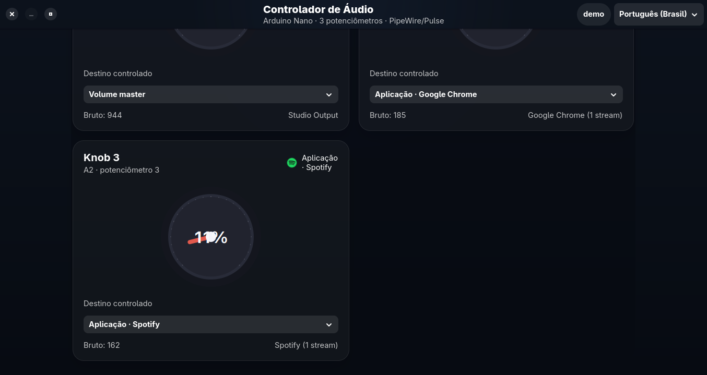

# Ioruba

Ioruba is a tactile Linux audio mixer for an `Arduino Nano ATmega328P` with `3x B10K` potentiometers on `A0`, `A1`, and `A2`.

The main product path is now the Haskell runtime:

- real serial-to-audio control for PipeWire and PulseAudio
- live auto-reconnect runtime with a polished terminal dashboard
- YAML-driven knob mapping for `master`, `applications`, and `microphone`
- automated Pages, release, and funding surface for a distribution-ready repo

[Website](https://bernardopg.github.io/ioruba/) | [Funding](FUNDING.md) | [Project Summary](PROJECT_SUMMARY.md)

## What Works Now

- Haskell runtime executable: `stack exec ioruba`
- Arduino Nano 3-knob setup with `512|768|1023` packets
- Legacy protocol compatibility for `P1:512`, `P2:768`, `P3:1023`
- Linux audio control through `pactl`, compatible with PipeWire and PulseAudio
- Serial autodetection for `/dev/ttyUSB*` and `/dev/ttyACM*`
- Live dashboard with status, meters, targets, and knob outcomes
- GitHub Pages generated from [`docs/config.yaml`](docs/config.yaml)
- Release Please, release bundles, funding surface, and repo metadata sync tooling

## Hardware

Recommended setup:

- `1x Arduino Nano ATmega328P`
- `3x B10K potentiometers`
- `A0` -> knob 1 wiper
- `A1` -> knob 2 wiper
- `A2` -> knob 3 wiper
- outer pins -> `5V` and `GND`

Detailed wiring, upload notes, and troubleshooting live in [NANO_SETUP.md](NANO_SETUP.md).

## Firmware

Use [arduino/ioruba-nano-3knobs/ioruba-nano-3knobs.ino](arduino/ioruba-nano-3knobs/ioruba-nano-3knobs.ino).

Compile:

```bash
arduino-cli compile --fqbn arduino:avr:nano arduino/ioruba-nano-3knobs
```

Upload for classic Nano clones with the old bootloader:

```bash
arduino-cli upload -p /dev/ttyUSB0 --fqbn arduino:avr:nano:cpu=atmega328old arduino/ioruba-nano-3knobs
```

## Run The Haskell Runtime

Build and test:

```bash
stack build
stack test
```

Run the mixer:

```bash
stack exec ioruba
```

Use a custom config file:

```bash
stack exec ioruba -- --config config/ioruba.yaml
```

Serial smoke tests:

```bash
stack exec test-serial /dev/ttyUSB0
```

## Configuration

The runtime is driven by [`config/ioruba.yaml`](config/ioruba.yaml).

Default mapping:

- knob 1: master output
- knob 2: applications such as Spotify, Google Chrome, and Firefox
- knob 3: microphone input

The public Pages site and repository metadata are driven by [`docs/config.yaml`](docs/config.yaml).

## Public Surface

- [FUNDING.md](FUNDING.md): sponsor links, Buy Me a Coffee, and QR support
- [PROJECT_SUMMARY.md](PROJECT_SUMMARY.md): product direction and positioning
- [TODO.md](TODO.md): current implementation backlog
- [QUICKSTART.md](QUICKSTART.md): runtime quick start
- [TESTING.md](TESTING.md): hardware and serial testing

## Visual Archive

The repository still keeps the legacy desktop screenshots as a design archive and product reference:





## Legacy Status

`legacy/arduino-audio-controller/` is still preserved for reference, but it is no longer the main path. The repository is being consolidated around the Haskell runtime so the project can be shipped with a cleaner, more maintainable distribution story.

## License

MIT
