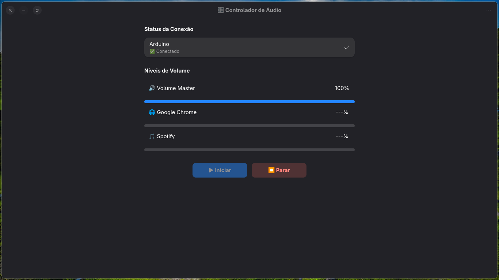

# Ioruba - Functional Audio Mixer for Linux

<div align="center">


**A modern, functional reimplementation of hardware-based audio control with a beautiful GUI**

[Features](#features) • [Installation](#installation) • [Quick Start](#quick-start) • [Documentation](#documentation) • [Contributing](#contributing)

</div>



---

## Overview

**Ioruba** is a Linux-native audio control system that bridges physical hardware (Arduino-based sliders) with your system's audio. Inspired by [deej](https://github.com/omriharel/deej), Ioruba is built from the ground up in Haskell with a focus on:

- **Functional purity** - Predictable, testable, maintainable code
- **Modern UI/UX** - Clean GTK-based interface with dark/light themes
- **Linux-first** - Full PulseAudio and PipeWire support
- **Extensibility** - Plugin system, profiles, and rich configuration

Control individual application volumes, master output, microphone input, and more with physical sliders connected to an Arduino.

## Features

### Core Functionality
- **Hardware Integration** - USB serial communication with Arduino-based sliders
- **Granular Audio Control** - Per-application volume, master volume, mic input
- **Real-time Visualization** - Live audio level meters with smooth animations
- **Profile System** - Quick-switch between audio configurations (work, gaming, streaming)

### Modern Interface
- **GTK+ 3 GUI** - Native Linux look and feel
- **Dark/Light Themes** - Automatic or manual theme switching
- **System Tray Integration** - Minimize to tray, quick controls
- **Keyboard Shortcuts** - Fully customizable hotkeys

### Configuration Management
- **YAML-based Config** - Human-readable, version-controllable
- **Live Reload** - Changes apply immediately without restart
- **Validation** - Detailed error messages for invalid configurations
- **Auto-rollback** - Automatically reverts to last working config on errors

### Productivity Features
- **Integrated Task Manager** - Track TODOs with priority and categorization
- **Desktop Notifications** - Reminders and audio event alerts
- **Interactive Documentation** - Built-in tutorials and help system
- **Calendar Integration** - Sync tasks with your calendar

### Developer Experience
- **Automatic Documentation** - Generated API docs and guides
- **Comprehensive Testing** - Property-based and integration tests
- **CI/CD Ready** - GitHub Actions workflows included
- **Extensible Architecture** - Clean module boundaries for easy contributions

## Installation

### Prerequisites

**System Dependencies:**
```bash
# Debian/Ubuntu
sudo apt install libpulse-dev libgtk-3-dev libappindicator3-dev

# Fedora
sudo dnf install pulseaudio-libs-devel gtk3-devel libappindicator-gtk3-devel

# Arch Linux
sudo pacman -S libpulse gtk3 libappindicator-gtk3
```

**Haskell Stack:**
```bash
curl -sSL https://get.haskellstack.org/ | sh
```

**Arduino Setup:**
```bash
# Add user to dialout group for serial access
sudo usermod -a -G dialout $USER
# Log out and back in for changes to take effect
```

### Build from Source

```bash
# Clone the repository
git clone https://github.com/bernardopg/ioruba.git
cd ioruba

# Build
stack build

# Install to ~/.local/bin
stack install

# Run
ioruba
```

### Desktop Integration

```bash
# Install launcher and icon
mkdir -p ~/.local/share/applications
cp assets/ioruba.desktop ~/.local/share/applications/

mkdir -p ~/.local/share/icons/hicolor/128x128/apps
cp assets/icon.png ~/.local/share/icons/hicolor/128x128/apps/ioruba.png
gtk-update-icon-cache ~/.local/share/icons/hicolor/
```

### Hardware Setup

1. **Build the Arduino Circuit:**
   - Connect 5 potentiometers to analog pins A0-A4
   - See `docs/guides/hardware-setup.md` for detailed wiring diagrams

2. **Upload Arduino Sketch:**
   ```bash
   cd arduino/ioruba-mixer
   # Using Arduino IDE: Open and upload
   # OR using PlatformIO:
   pio run --target upload
   ```

3. **Configure Serial Port:**
   - Edit `config/ioruba.yaml`
   - Set `serial_port` to your Arduino device (e.g., `/dev/ttyUSB0`)

## Quick Start

### First Run

1. **Launch Ioruba:**
   ```bash
   ioruba
   ```

2. **Configure Slider Mappings:**
   - Click the settings icon or press `Ctrl+,`
   - Map each slider to applications or system outputs
   - Save configuration

3. **Test Sliders:**
   - Move physical sliders
   - Watch volume levels change in the GUI
   - Verify audio output adjusts accordingly

### Example Configuration

`config/ioruba.yaml`:
```yaml
serial:
  port: /dev/ttyUSB0
  baud_rate: 9600

sliders:
  - id: 0
    name: "Master Volume"
    targets:
      - type: master

  - id: 1
    name: "Music"
    targets:
      - type: application
        name: "Spotify"
      - type: application
        name: "rhythmbox"

  - id: 2
    name: "Browser"
    targets:
      - type: application
        name: "Firefox"
      - type: application
        name: "Chrome"

  - id: 3
    name: "Communications"
    targets:
      - type: application
        name: "Discord"
      - type: application
        name: "Slack"

  - id: 4
    name: "Microphone"
    targets:
      - type: source
        name: "default_microphone"

audio:
  noise_reduction: default
  smooth_transitions: true
  transition_duration_ms: 50

gui:
  theme: dark
  show_visualizers: true
  tray_icon: true
```

## Documentation

- **[User Guide](docs/guides/user-guide.md)** - Complete usage instructions
- **[Hardware Setup](docs/guides/hardware-setup.md)** - Wiring diagrams and Arduino setup
- **[Configuration Reference](docs/guides/configuration.md)** - All config options explained
- **[API Documentation](docs/api/)** - Haddock-generated API docs
- **[Architecture Overview](CLAUDE.md)** - For developers

## Development

### Project Structure

```
ioruba/
├── src/               # Haskell source code
│   ├── Audio/        # PulseAudio/PipeWire integration
│   ├── GUI/          # GTK interface components
│   ├── Config/       # Configuration management
│   ├── Hardware/     # Serial communication
│   ├── Tasks/        # Task management system
│   └── Utils/        # Shared utilities
├── app/              # Main application entry point
├── test/             # Test suites
├── arduino/          # Arduino firmware
├── docs/             # Documentation
├── config/           # Example configurations
├── assets/           # Icons, themes, resources
└── legacy/arduino-audio-controller/  # Archived Python/GTK4 prototype
```

### Running Tests

```bash
# All tests
stack test

# Specific test suite
stack test :ioruba-test

# With coverage
stack test --coverage

# Watch mode (using ghcid)
ghcid --command "stack ghci ioruba:lib ioruba:test:ioruba-test" --test "main"
```

### Code Style

We use [Ormolu](https://github.com/tweag/ormolu) for formatting and [HLint](https://github.com/ndmitchell/hlint) for linting:

```bash
# Format all code
find src -name "*.hs" -exec ormolu -i {} \;

# Run linter
stack exec -- hlint src/
```

## Contributing

Contributions are welcome! Please see [CONTRIBUTING.md](CONTRIBUTING.md) for guidelines.

### Development Workflow

1. Fork the repository
2. Create a feature branch: `git checkout -b feature/my-feature`
3. Make your changes
4. Run tests: `stack test`
5. Format code: `ormolu -i src/**/*.hs`
6. Commit with descriptive message
7. Push and create a Pull Request

## Roadmap

- [ ] Windows support via WASAPI
- [ ] macOS support via CoreAudio
- [ ] Plugin system for custom audio processors
- [ ] Web interface for remote control
- [ ] MIDI controller support
- [ ] Equalizer presets per application
- [ ] Cloud profile sync
- [ ] Mobile app for remote control

## Inspiration

This project is inspired by:
- [deej](https://github.com/omriharel/deej) - The original hardware audio mixer
- [PulseAudio](https://www.freedesktop.org/wiki/Software/PulseAudio/) - Linux audio server
- [PipeWire](https://pipewire.org/) - Modern multimedia framework

## License

MIT License - see [LICENSE](LICENSE) for details.

## Support

- **Issues:** [GitHub Issues](https://github.com/bernardopg/ioruba/issues)
- **Discussions:** [GitHub Discussions](https://github.com/bernardopg/ioruba/discussions)
- **Documentation:** [Wiki](https://github.com/bernardopg/ioruba/wiki)

---

<div align="center">

**Made with ❤️ using Haskell**

[⬆ Back to Top](#iarubá---functional-audio-mixer-for-linux)

</div>
