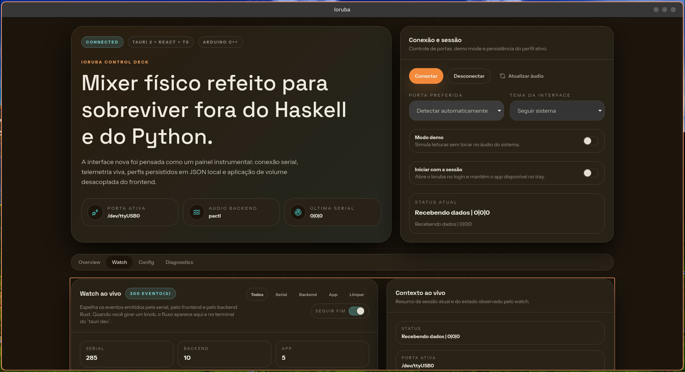

<div align="center">

[](https://github.com/bernardopg/ioruba/actions/workflows/release.yml)
[](https://github.com/bernardopg/ioruba/actions/workflows/ci.yml)
[](../../../../package.json)
[](./TODO.md)
[](https://github.com/bernardopg/ioruba/commits/main)
[](../../../../LICENSE)

<br />

[](https://github.com/sponsors/bernardopg)
[](https://www.buymeacoffee.com/WctwoM9eMU)

<br />

[](https://tauri.app/)
[](https://www.rust-lang.org/)
[](https://www.typescriptlang.org/)
[](https://isocpp.org/)
[](https://www.arduino.cc/)
[](https://nodejs.org/en)
[](../README.md)

<br />

[](#%EF%B8%8F-suporte-de-plataforma)
[](#%EF%B8%8F-suporte-de-plataforma)
[](#%EF%B8%8F-suporte-de-plataforma)
[](#%EF%B8%8F-suporte-de-plataforma)

</div>

# Ioruba

Ioruba transforma um **Arduino Nano + 3 knobs** em um controle físico para desktop.
A stack ativa é um app desktop em **Tauri 2 + React + TypeScript**, com camada de áudio em **Rust** (via `pactl` no Linux) e firmware em **Arduino C++**.

> **Status atual de plataforma**
> O controle real de áudio está pronto para produção no **Linux** via `pactl`.
> Builds para macOS e Windows são úteis para revisão de UI, empacotamento e modo demo, mas ainda **não** possuem backend de áudio funcional.

## 📚 Links rápidos

- [Releases](https://github.com/bernardopg/ioruba/releases)
- [Início Rápido](./QUICKSTART.md)
- [Setup de Hardware](../guides/hardware-setup.md)
- [Setup do Nano](./NANO_SETUP.md)
- [Exemplos de Perfil](../guides/profile-examples.md)
- [Guia de Tradução](../guides/translation-guide.md)
- [Docs PT‑BR](../README.md)
- [Suporte & Depuração](../debug/support.md)
- [Testes](./TESTING.md)
- [Contribuição](./CONTRIBUTING.md)
- [Financiamento](./FUNDING.md)
- [Roadmap](./TODO.md)


_Screenshot arquivado – referência visual da direção do painel tátil._

---

## 🎛️ Por que este repositório existe

O projeto preserva a sensação prática de um mixer pequeno enquanto moderniza a stack:

- **Runtime desktop** – `apps/desktop` (Tauri 2, React, TypeScript, Zustand)
- **Firmware** – `firmware/arduino/ioruba-controller` (Arduino Nano C++)
- **Lógica compartilhada** – `packages/shared` (tipos de domínio, parsing de protocolo, matemática de runtime)
- **Backend Linux** – implementação em Rust usando `pactl`
- **Persistência** – perfis JSON no diretório de configuração do app
- **CI** – valida TypeScript, Rust e compilação do firmware
- **Legado** – protótipo Python/GTK arquivado em `legacy/`

## ✅ O que você recebe hoje

- Pacotes seriais como `512|768|1023` (três valores de 10 bits)
- Handshake de firmware: `HELLO board=...; fw=...; protocol=...; knobs=...`
- Compatibilidade com o formato legado `P1:512`
- Telemetria ao vivo e watch log persistente no app desktop
- Perfis JSON editáveis (persistidos por plataforma)
- Modo demo para validar UI sem alterar o áudio real
- Tratamento de alvos Linux para **master**, **application**, **source** e **sink**
- CI para validação desktop/shared e compilação do firmware
- Workflows de release com bundles desktop e metadados Arch (`PKGBUILD` + `.SRCINFO`)

## 🖥️ Suporte de plataforma

| Plataforma | Status | Notas |
|----------|-----------|---------------------------------------------------------------------------------------------------|
| Linux    | ✅ Suportado | Caminho principal de produção: serial, backend `pactl`, modo demo e validação de hardware. |
| macOS    | ⚠️ Parcial  | Shell desktop e modo demo funcionam; controle de áudio real ainda não implementado. |
| Windows  | ⚠️ Parcial  | Shell desktop e modo demo funcionam; controle de áudio real ainda não implementado. |

> **Nota:** Linux é a única plataforma com backend de áudio pronto para produção (`pactl`) no momento.

## ⚡ Instalação rápida

Instaladores pré-build ficam no latest release:
[https://github.com/bernardopg/ioruba/releases/latest](https://github.com/bernardopg/ioruba/releases/latest)

### Arch Linux (AUR)

```bash
# Build de source
yay -S ioruba-desktop

# AppImage pré-build
yay -S ioruba-desktop-bin
```

### Debian / Ubuntu / Linux Mint / Pop!_OS

```bash
curl -s https://api.github.com/repos/bernardopg/ioruba/releases/latest \
  | jq -r '.assets[] | select(.name | test("\\.deb$")) | .browser_download_url' \
  | xargs -n1 curl -LO

sudo apt install ./Ioruba_*_amd64.deb
```

### Fedora / RHEL / CentOS Stream / openSUSE (RPM)

```bash
curl -s https://api.github.com/repos/bernardopg/ioruba/releases/latest \
  | jq -r '.assets[] | select(.name | test("\\.rpm$")) | .browser_download_url' \
  | xargs -n1 curl -LO

# Para Fedora/RHEL via dnf:
sudo dnf install ./Ioruba-*.x86_64.rpm
# Para zypper (openSUSE) ou yum (CentOS antigo), ajuste o comando.
```

### Qualquer distro Linux (AppImage)

```bash
curl -s https://api.github.com/repos/bernardopg/ioruba/releases/latest \
  | jq -r '.assets[] | select(.name | test("\\.AppImage$")) | .browser_download_url' \
  | xargs -n1 curl -LO

chmod +x Ioruba_*.AppImage
./Ioruba_*.AppImage
```

### Windows

Baixe os assets de instalador do Windows no latest release (`.exe` / `.msi`).

### macOS (Apple Silicon e Intel)

Baixe o arquivo do bundle de app do macOS no latest release:
- `Ioruba_..._aarch64.app.tar.gz`
- `Ioruba_..._x64.app.tar.gz`

> **Lembrete:** no macOS e Windows o app roda em modo UI/demo; controle de áudio real exige Linux.

## 🧰 Pré-requisitos (para build por código-fonte)

- **Node.js** `22` (mesma major usada no CI) + `npm`
- **Rust** stable + `cargo`
- `arduino-cli`
- `pactl` (apenas Linux, para backend de áudio)
- Git

## 🚀 Início rápido (source)

```bash
# 1️⃣ Clonar e instalar
git clone https://github.com/bernardopg/ioruba.git
cd ioruba
npm install

# 2️⃣ Verificar a stack
npm run verify   # typecheck, testes, checks Rust e build desktop

# 3️⃣ Compilar firmware (opcional se a placa já estiver gravada)
npm run firmware:compile

# 4️⃣ Subir app desktop
npm run desktop:dev   # só frontend (iteração rápida)
npm run desktop:watch # shell Tauri completo (serial, persistência, backend)

# 5️⃣ Setup de hardware
#   - Fiação do controlador -> docs/guides/hardware-setup.md
#   - Gravação do Nano      -> NANO_SETUP.md
#   - Perfis de exemplo     -> docs/guides/profile-examples.md
```

### O que confirmar quando o app abrir

1. O app detecta portas seriais (ou usa a porta preferida).
2. O card de status avança pelos estados de conexão (sem ficar em “idle”).
3. O runtime recebe o handshake (`HELLO …`) junto dos frames de knobs.
4. A aba **Watch** mostra frames como `512|768|1023`.
5. Girar os knobs move o gráfico de telemetria.
6. O perfil ativo é salvo em JSON e sobrevive a reinícios.
7. Clicar em **Atualizar áudio** recarrega o inventário de áudio Linux.
8. Os knobs controlam os alvos configurados (master, apps, microfone etc.).

Mapeamento padrão de perfil:

| Knob | Rótulo padrão | Alvo |
|------|--------------------|------------------------------------------------|
| 1    | Master Volume      | Saída padrão / volume master |
| 2    | Applications       | Spotify, Google Chrome, Firefox |
| 3    | Microphone         | Entrada padrão de microfone |

## 📂 Onde o app salva dados

O app desktop persiste dois arquivos no diretório de configuração da plataforma:

- `ioruba-state.json` – perfil ativo e estado de runtime
- `ioruba-watch.log` – eventos estruturados de watch (auto-trim para ~1 MiB)

| SO      | Caminho |
|---------|----------------------------------------------------------|
| Linux   | `~/.config/io.ioruba.desktop/` |
| macOS   | `~/Library/Application Support/io.ioruba.desktop/` |
| Windows | `%APPDATA%\\io.ioruba.desktop\\` |

## 🧰 Scripts npm comuns

| Script                         | Descrição |
|--------------------------------|------------------------------------------------------------------------|
| `npm run verify`               | Validação completa: typecheck, testes, Rust e build desktop. |
| `npm run desktop:dev`          | Inicia frontend Vite (trabalho de UI). |
| `npm run desktop:watch`        | Inicia shell desktop Tauri completo (desenvolvimento). |
| `npm run desktop:icons`        | Regenera ícones desktop a partir de `app-icon.svg`. |
| `npm run desktop:tauri:build`  | Build local do app Tauri (sem instaladores). |
| `npm run firmware:compile`     | Compila firmware Arduino Nano. |
| `npm run rust:test`            | Roda testes do backend Rust. |
| `npm run rust:audit`           | Audita lockfile Rust (inclui backport local de glib). |

## 🗂️ Mapa do repositório

| Caminho                                 | Objetivo |
|--------------------------------------|----------------------------------------------------------------------------|
| `apps/desktop`                       | App Tauri 2, UI React, estado Zustand e dashboards de telemetria. |
| `apps/desktop/src-tauri`             | Comandos Rust (persistência, watch log, controle de áudio Linux). |
| `packages/shared`                    | Tipos de domínio, defaults, matemática de runtime e parsing de protocolo. |
| `firmware/arduino/ioruba-controller` | Firmware Arduino para placas compatíveis com Nano. |
| `docs/guides`                        | Guias práticos (hardware, Nano, perfis, traduções). |
| `docs/migration`                     | Planejamento de migração e auditoria de paridade. |
| `legacy`                             | Protótipo Python/GTK arquivado e histórico. |
| `docs/debug/support.md`              | Playbook de suporte para serial, áudio e perfis. |
| `TESTING.md`                         | Checks automatizados, smoke tests e matriz de validação de release. |

## 📚 Mapa da documentação

| Documento                                                          | Quando você precisa de… |
|-------------------------------------------------------------------|---------------------------------------------------------------------------|
| [QUICKSTART.md](./QUICKSTART.md)                                    | Caminho mais rápido para subir o app (Linux). |
| [NANO_SETUP.md](./NANO_SETUP.md)                                    | Gravar e validar o Arduino Nano. |
| [docs/guides/hardware-setup.md](../guides/hardware-setup.md)    | Fiação do controlador físico (potenciômetros, protoboard/caixa). |
| [docs/guides/profile-examples.md](../guides/profile-examples.md)| Exemplos de perfis JSON e regras de correspondência de alvos Linux. |
| [docs/guides/translation-guide.md](../guides/translation-guide.md)| Como funcionam traduções no app desktop e passos de validação. |
| [docs/translations/pt-br/README.md](../README.md)| Índice de tradução em português para docs e manuais da raiz. |
| [docs/debug/support.md](../debug/support.md)                    | Troubleshooting serial, áudio e perfil. |
| [TESTING.md](./TESTING.md)                                          | Checks automatizados, smoke tests e validação de release. |
| [docs/migration/logic-audit.md](../migration/logic-audit.md)    | Cobertura de paridade com implementação Python/GTK arquivada. |
| [CONTRIBUTING.md](./CONTRIBUTING.md)                                | Diretrizes de contribuição (código, docs, tradução etc.). |
| [FUNDING.md](./FUNDING.md)                                          | Como apoiar o projeto (GitHub Sponsors, Buy Me a Coffee etc.). |
| [TODO.md](./TODO.md)                                                | Roadmap e próximas features. |

## 🗃️ Arquivo legado

O repositório mantém uma implementação arquivada para referência histórica:

- `legacy/arduino-audio-controller`

Contexto de migração detalhado fica em `docs/migration`. A superfície **ativa** do produto está em:
- `apps/desktop`
- `packages/shared`
- `firmware/arduino/ioruba-controller`

## 📜 Licença

MIT © Bernardo Gomes
