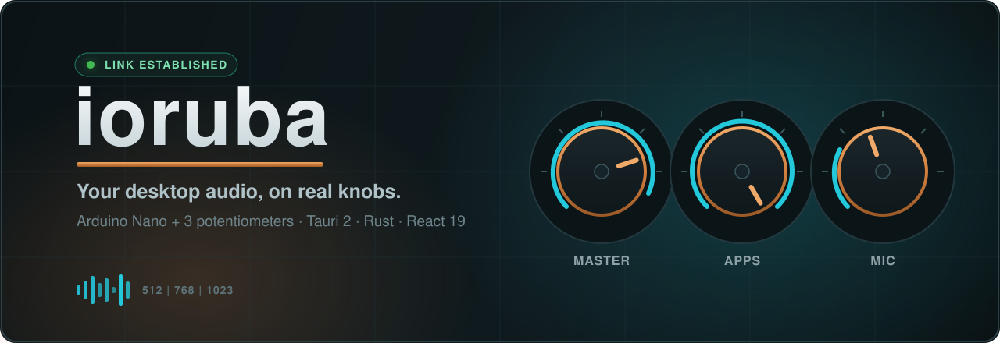
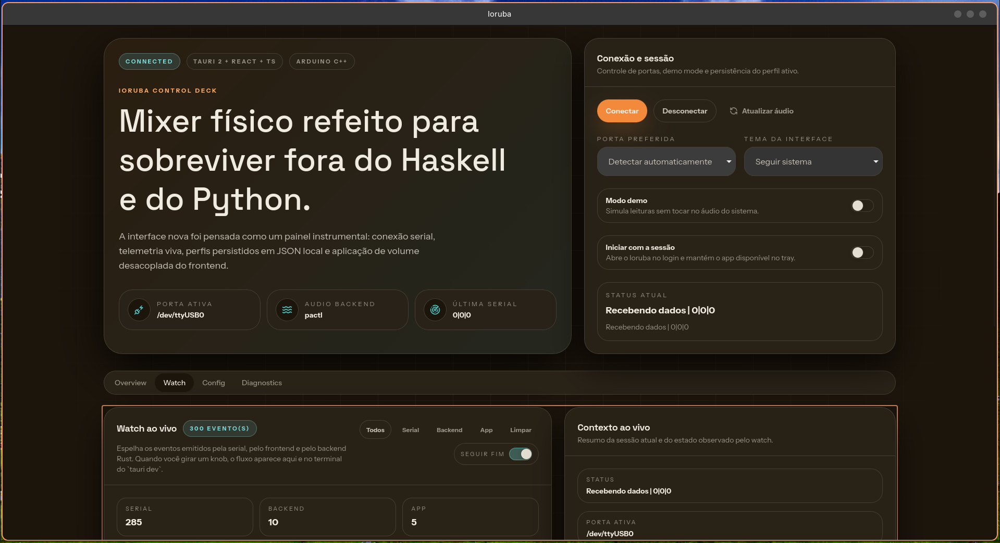

<div align="center">



<br />
<br />

**Um painel tátil de áudio para desktop, feito com Arduino, Tauri, React e Rust.**

[](https://github.com/bernardopg/ioruba/actions/workflows/release.yml)
[](https://github.com/bernardopg/ioruba/actions/workflows/ci.yml)
[](../../../../package.json)
[](../../../../LICENSE)

[**Download**](https://github.com/bernardopg/ioruba/releases/latest) · [**Início rápido**](QUICKSTART.md) · [**Montar o controlador**](../guides/hardware-setup.md) · [**Índice PT-BR**](../README.md)

</div>

## O que é o Ioruba?

O Ioruba transforma hardware barato de microcontrolador em um controlador físico de áudio para desktop. A montagem de referência usa **Arduino Nano e três potenciômetros**, mas o firmware também aceita configurações com Uno, Mega 2560, Leonardo/Micro, ESP32, RP2040/Pico e ESP8266.

Ao girar um knob, o Ioruba lê o frame serial, aplica o perfil ativo, atualiza a telemetria e altera o alvo de áudio. No Linux, o alvo pode ser a saída master, aplicações, sinks ou sources. Windows e macOS atualmente controlam apenas a saída padrão.



## Destaques

- knobs, botões e encoders físicos opcionais;
- firmware parametrizável de 1 a 16 knobs, conforme a placa;
- ADC de 10/12 bits, calibração em EEPROM e handshake com diagnóstico;
- controle Linux completo via `pactl`;
- volume `master` no Windows via WASAPI e no macOS via CoreAudio;
- presets, editor visual, JSON avançado e import/export de perfis;
- telemetria, estatísticas de sessão exportáveis e watch log persistente;
- tray, atalho `Ctrl+Alt+I`, inicialização com a sessão e atualização in-app assinada;
- interface em português do Brasil, inglês e espanhol;
- releases com checksums, provenance e manifests de gerenciadores de pacotes.

## Suporte de plataforma

| Plataforma | Áudio | Distribuição |
| --- | --- | --- |
| **Linux** | Completo: `master`, `application`, `sink` e `source` via interface `pactl` compatível com PulseAudio/PipeWire. | `.deb`, `.rpm`, AppImage e AUR. |
| **Windows** | Parcial: volume e mute da saída padrão (`master`) via WASAPI. | MSI/NSIS; Scoop e manifests winget. Bundles sem assinatura — o SmartScreen alerta "aplicativo não reconhecido"; use **Mais informações → Executar assim mesmo**. |
| **macOS** | Parcial: volume da saída padrão (`master`) via CoreAudio. | `.app.tar.gz` para Apple Silicon/Intel e cask Homebrew. Bundles sem assinatura e sem notarização; o instalador e o cask removem o atributo de quarentena. |

O projeto não possui certificado Apple Developer ID nem Authenticode da
Microsoft, então os bundles não carregam assinatura de plataforma. Verifique
qualquer download com o `SHA256SUMS.txt` publicado, ou com
`gh attestation verify <asset> --repo bernardopg/ioruba`. As atualizações in-app
usam a chave própria do updater e são sempre verificadas antes de instalar.

Serial, perfis, modo demo, telemetria e diagnósticos funcionam nas três plataformas. Alvos por aplicação/source/sink continuam exclusivos do Linux.

## Instalação

### Linux e macOS

```bash
curl -fsSL https://raw.githubusercontent.com/bernardopg/ioruba/main/scripts/install.sh | sh
```

O padrão no Linux é AppImage sem root em `~/.local/bin/ioruba.AppImage`. O instalador exige uma entrada exata em `SHA256SUMS.txt` e recusa instalação sem verificação. Opções locais:

```bash
./scripts/install.sh --version v1.8.2
./scripts/install.sh --type appimage
./scripts/install.sh --type deb
./scripts/install.sh --type rpm
./scripts/install.sh --dir "$HOME/.local/bin"
```

No macOS, o instalador usa `/Applications` quando possível e `~/Applications` como fallback.

### Windows

No PowerShell:

```powershell
irm https://raw.githubusercontent.com/bernardopg/ioruba/main/scripts/install.ps1 | iex
```

O padrão é MSI. Opções locais:

```powershell
.\scripts\install.ps1 -Version v1.8.2 -Type msi
.\scripts\install.ps1 -Type nsis
```

> Revise scripts remotos antes de enviá-los ao shell. Fontes: [`install.sh`](../../../../scripts/install.sh) e [`install.ps1`](../../../../scripts/install.ps1).

### Gerenciadores de pacotes

- Arch: `yay -S ioruba-desktop` ou `yay -S ioruba-desktop-bin`;
- Homebrew: `brew tap bernardopg/ioruba && brew install --cask ioruba`;
- Scoop: `scoop bucket add ioruba https://github.com/bernardopg/scoop-ioruba && scoop install ioruba`.

## Primeiro uso

1. Instale o app ou faça o [setup de desenvolvimento](#desenvolvimento).
2. Monte e grave o controlador com o [guia de hardware](../guides/hardware-setup.md) e o [setup do Nano](NANO_SETUP.md).
3. Abra o Ioruba e selecione a porta serial, se necessário.
4. Confirme conexão, handshake e frames na seção **Watch**.
5. Abra **Configurações → Editor de perfil** e escolha os alvos.
6. No Linux, inicie os apps de áudio e clique em **Atualizar áudio**.

O firmware atual usa **115200 baud**, protocolo **2** e emite:

```text
HELLO board=Ioruba Nano; fw=0.6.1; protocol=2; knobs=3; mcu=ATmega328P; adcBits=10; threshold=4; deadzone=7; smooth=75; mins=0,0,0; maxs=1023,1023,1023
512|768|1023
```

O parser ainda aceita `P1:512`, e perfis com o antigo padrão de 9600 baud são migrados automaticamente.

### Perfil padrão

| Knob | Alvo |
| --- | --- |
| 1 | Volume master / saída padrão |
| 2 | Spotify, Google Chrome e Firefox |
| 3 | Microfone padrão |

## Desenvolvimento

Pré-requisitos: Node.js 22/npm, Rust/Cargo, `arduino-cli`, dependências do Tauri e `pactl` para áudio Linux.

```bash
git clone https://github.com/bernardopg/ioruba.git
cd ioruba
npm install
npm run verify
npm run firmware:compile
npm run desktop:watch
```

| Comando | Uso |
| --- | --- |
| `npm run verify` | Typecheck, testes shared/desktop/Rust e build frontend. |
| `npm run ci` | `verify` + compilação do firmware Nano. |
| `npm run desktop:dev` | Frontend Vite sem integrações nativas. |
| `npm run desktop:watch` | App Tauri completo. |
| `npm run desktop:tauri:build` | Binário Tauri local, sem instaladores. |
| `npm run firmware:compile:matrix` | Matriz AVR. |
| `npm run release:check` | Gate local estendido de release. |

## Dados e recuperação

- `ioruba-state.json`: perfis e preferências;
- `ioruba-watch.log`: eventos persistentes, limitado a cerca de 1 MiB;
- `ioruba-state.backup.*.json`: backup ao substituir estado incompatível/corrompido.

| SO | Diretório |
| --- | --- |
| Linux | `~/.config/io.ioruba.desktop/` |
| macOS | `~/Library/Application Support/io.ioruba.desktop/` |
| Windows | `%APPDATA%\io.ioruba.desktop\` |

Apagar apenas `ioruba-state.json` restaura defaults seguros. Faça backup antes. Consulte o [playbook de suporte](../debug/support.md).

## Arquitetura do repositório

| Caminho | Responsabilidade |
| --- | --- |
| `apps/desktop` | UI React e shell Tauri. |
| `packages/shared` | Tipos, defaults, protocolo, validação, presets e matemática. |
| `firmware/arduino/ioruba-controller` | Firmware parametrizável e testes host. |
| `docs` | Guias, suporte, roadmap, planos e traduções. |
| `docs-site` | Layout/navegação/estilo do GitHub Pages. |
| `scripts` | Instalação, packaging, AppImage e geração de docs. |

## Documentação

- [Índice PT-BR](../README.md)
- [Início rápido](QUICKSTART.md)
- [Setup de hardware](../guides/hardware-setup.md)
- [Setup do Nano](NANO_SETUP.md)
- [Exemplos de perfil](../guides/profile-examples.md)
- [Suporte](../debug/support.md)
- [Testes](TESTING.md)
- [Contrato do backend](../guides/audio-backend-contract.md)
- [Contribuição](CONTRIBUTING.md)
- [Roadmap](../../../roadmap.md) e [TODO](../../../../TODO.md)
- [Changelog](CHANGELOG.md)

## Licença

MIT © Bernardo Gomes. Consulte [`LICENSE`](../../../../LICENSE).
