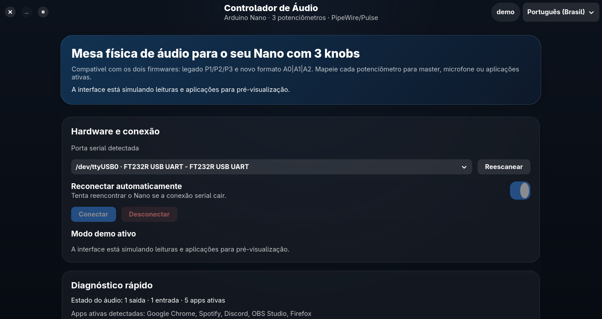
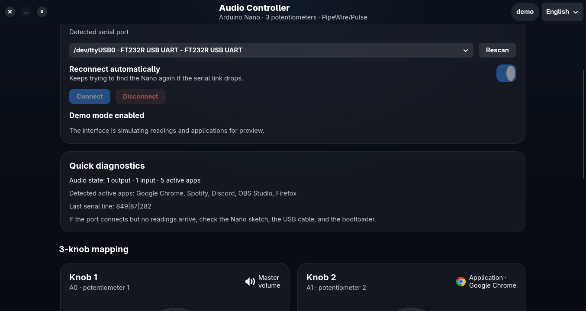

# Arduino Audio Controller

Archived Python/GTK4 desktop app for the `Arduino Nano + 3 potentiometers` setup.

This is no longer the recommended runtime in the repository. The active product path now lives in `apps/desktop`.

## Gallery

### Main screen



### Knob deck and configured app icons


### English layout



## Hardware Spec

- Arduino Nano ATmega328P
- 3 potentiometers on:
  - `A0`
  - `A1`
  - `A2`
- 9600 baud serial link

## Supported Firmware Protocols

- Legacy:
  - `P1:512`
  - `P2:768`
  - `P3:1023`
- Current:
  - `512|768|1023`

Recommended sketch:

- [../../firmware/arduino/ioruba-controller/ioruba-controller.ino](../../firmware/arduino/ioruba-controller/ioruba-controller.ino)

Legacy sketch kept for reference:

- [arduino_audio_controller.ino](arduino_audio_controller.ino)

## Features

- Serial port autodetection
- Auto reconnect when the Nano disappears and comes back
- Mapping for master, microphone, and active applications
- App icons on each configured knob
- Animated dials in the UI
- Responsive layout
- `pt-BR` and `en`
- System locale detection with English fallback
- Live language switcher in the header
- Demo mode for previews and screenshots

## Install

### Dependencies

On Arch-based systems:

```bash
sudo pacman -S arduino-cli python python-gobject gtk4 libadwaita imagemagick
```

The wrapper bootstraps the local `.venv` and installs the Python packages from `requirements.txt` when needed.

### Local install

```bash
./install_local.sh
```

This installs:

- `~/.local/bin/audio-controller-gui`
- the desktop entry
- the application icon

## Run

```bash
audio-controller-gui
```

Direct wrapper usage:

```bash
./audio_controller_gui_wrapper.sh
./audio_controller_gui_wrapper.sh --demo
./audio_controller_gui_wrapper.sh --lang en
```

## Settings

The UI persists preferences in:

```bash
~/.config/ioruba-controlador/settings.json
```

Stored values include:

- preferred serial port
- knob mappings
- auto-connect state
- last window size
- selected language

## Firmware and Upload

Compile and upload the maintained sketch from the repository root:

```bash
arduino-cli compile --fqbn arduino:avr:nano firmware/arduino/ioruba-controller
arduino-cli upload -p /dev/ttyUSB0 --fqbn arduino:avr:nano firmware/arduino/ioruba-controller
```

If a clone Nano fails with the default bootloader:

```bash
arduino-cli upload -p /dev/ttyUSB0 --fqbn arduino:avr:nano:cpu=atmega328old firmware/arduino/ioruba-controller
```

More hardware notes live in [../../NANO_SETUP.md](../../NANO_SETUP.md).

## Troubleshooting

### Port opens but no readings arrive

- confirm the correct sketch is flashed
- confirm the Nano is outputting `9600` baud
- make sure no other app is holding `/dev/ttyUSB0`
- test first in the Arduino IDE serial monitor or the active Tauri app watch tab

### Upload fails with `not in sync`

- try the old bootloader variant
- press reset right before upload
- check whether the board is actually a different clone profile
- verify the USB cable carries data, not only power

### No per-app targets appear

- start audio playback in the target app
- refresh the UI
- confirm PipeWire/PulseAudio is exposing sink inputs

## Project Status

- This GTK app is archived for reference only
- The active desktop app is the Tauri shell in `apps/desktop`
- The maintained firmware and setup guides now live under `firmware/arduino/ioruba-controller` and the root docs
